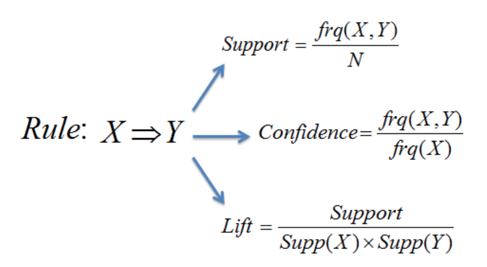

# Tips-for-MBA-analysis

## Table of Contents
1. Introduction of Market Basket Analysis (MBA)
2. Example
3. Tech Stack

## 1 Introduction of Market Basket Analysis (MBA) 

Market Basket Analysis is an important technique used by large retailers to discover associations between items. It works by looking for combinations of items that occur together frequently in transactions (source: https://bit.ly/2xFRaS3).

And its math of rule is expressed inline image

  
## 2 Example 

Market Basket Analysis often be used for analyzing cross-selling opportunity in business. This dashboard not only present high-level view performance on Amazon e-commerce platform, but also discovery the the cross-selling opportunity between products.  

Url: https://lnkd.in/gUz2v5t

## 3 Tech Stack

* Python
* ETL
* Data Visualization (Google Data Studio)
* Apriori algorithm (Market Basket Analysis)

